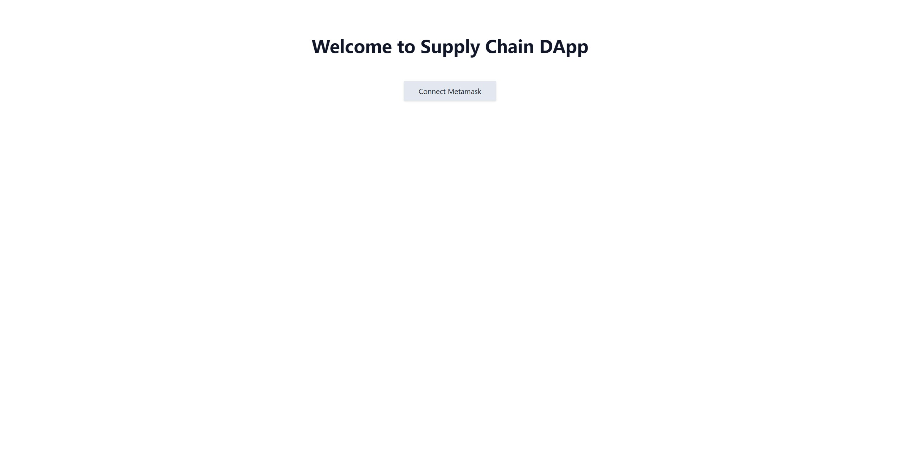
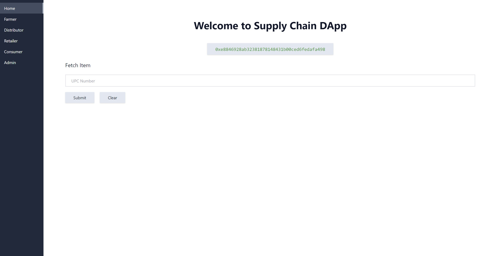
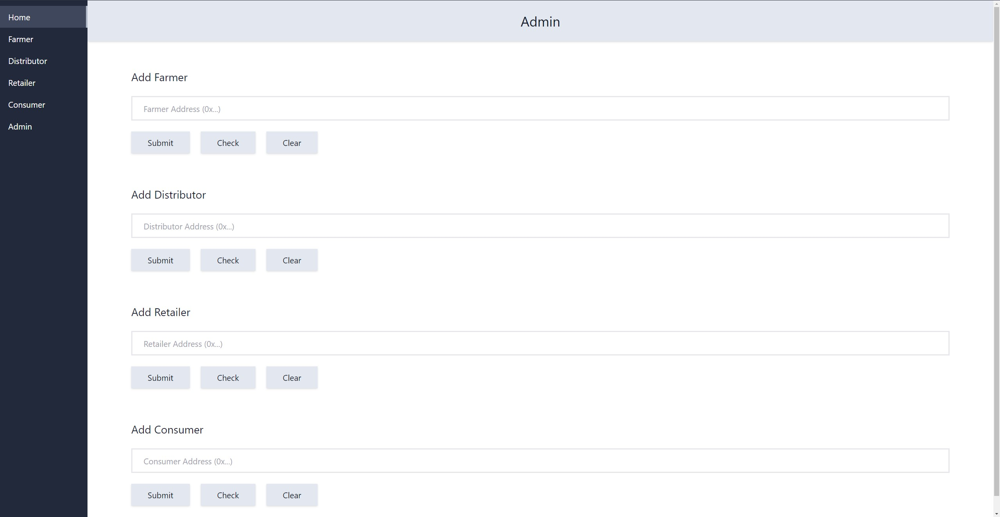
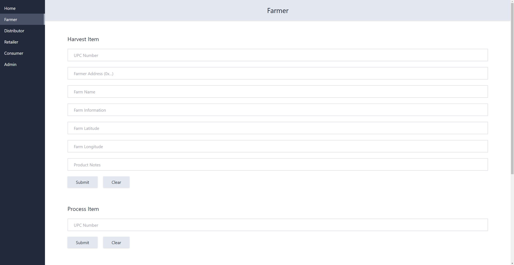
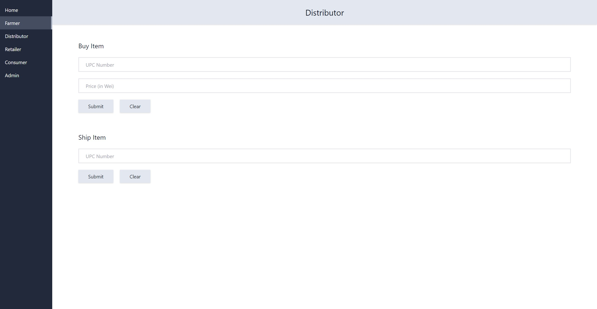
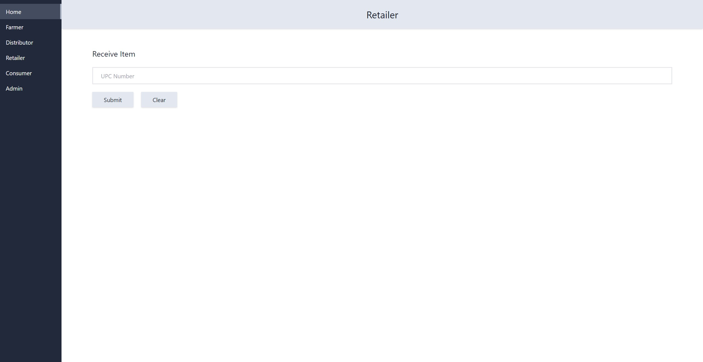
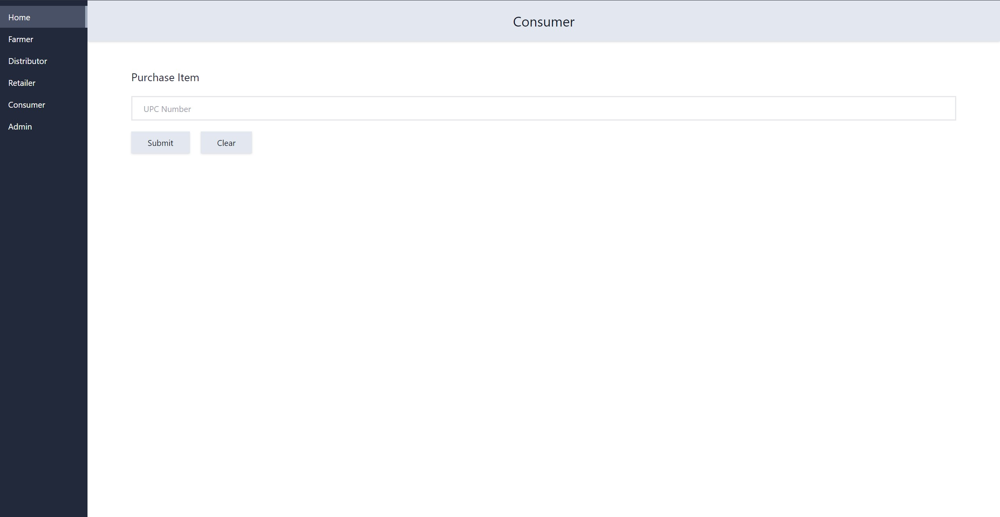

# Udacity Blockchain Developer Nanodegree Project 3 Submission

This is Project 3 (Supply Chain DApp) submission for Udacity's Blockchain Developer Nanodegree.

## UML Diagrams

### Activity Diagram

Following is the UML activity diagram for the project.


### Sequence Diagram

Following is the UML sequence diagram for the project.


### State Diagram

Following is the UML state diagram for the project.

<!-- TODO -->

### Class Diagram

Following is the UML class diagram for the project.

<!-- TODO -->

## Libraries

### Backend

- Truffle `v5.5.12`
- Ganache `v7.1.0`
- Solidity `v0.8.13`
- NodeJS `v16.15.0`

### Frontend

- React `v18.1.0` (used because I wanted to learn React 18)
- Web3.js `v1.7.3`
- Tailwind CSS `v3.0.24` (used for easy CSS styling)

> Note: IPFS was not used in this project.

## Description

### Testing

Start `ganache` development blockchain:

```bash
ganache
```

In a separate terminal, run tests using `truffle test`.

### Deployment

To deploy the project, start `ganache` development blockchain:

```bash
ganache
```

In a separate terminal, execute the following commands:

```bash
truffle compile
truffle migrate
```

### Usage

Once the smart contract is deployed on local `ganache` blockchain, start the `supply-chain` DApp:

```bash
cd supply-chain
npm start
```

Now, open `http://localhost:3000` in browser window and click the `Connect Metamask` button:



Once metamask is connected, you'll see Supply Chain DApp home page:



Go to the **Admin** tab and add all the necessary addressed in different roles (Farmer, Distributor, Retailer and
Consumer). You can also check if an address is already added to the role using `Check` button.



Now, go to the **Farmer** tab and perform all the farmer actions (Harvest, Process, Pack and Sell).



Now, go to the **Distributor** tab and perform all the distributor actions (Buy and Ship).



Now, go to the **Retailer** tab and perform all the retailer actions (Receive).



Now, go to the **Consumer** tab and perform all the consumer actions (Purchase).



Finally, go to the **Home** tab and fetch the details of the item.

> Note: The smart contract implements role management, so remember to add all the roles before performing any action.
Also, remember to perform each action using the correct role (correct wallet).
